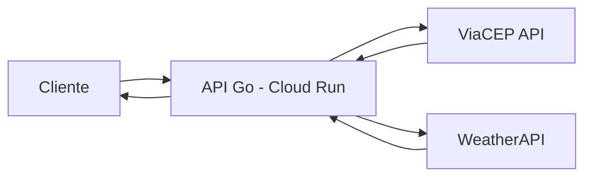
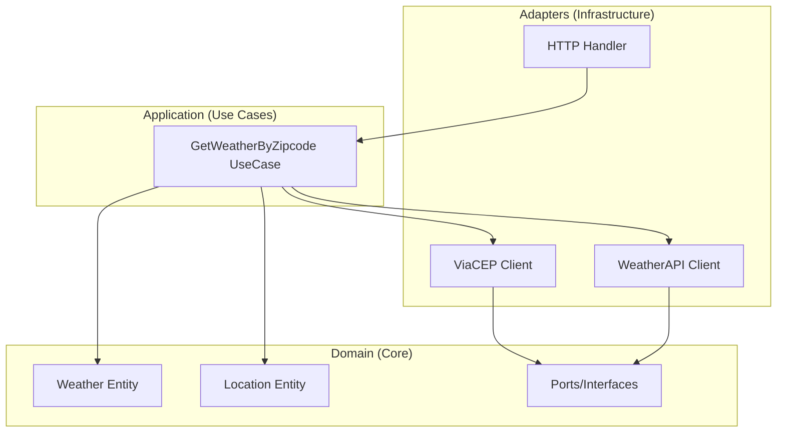
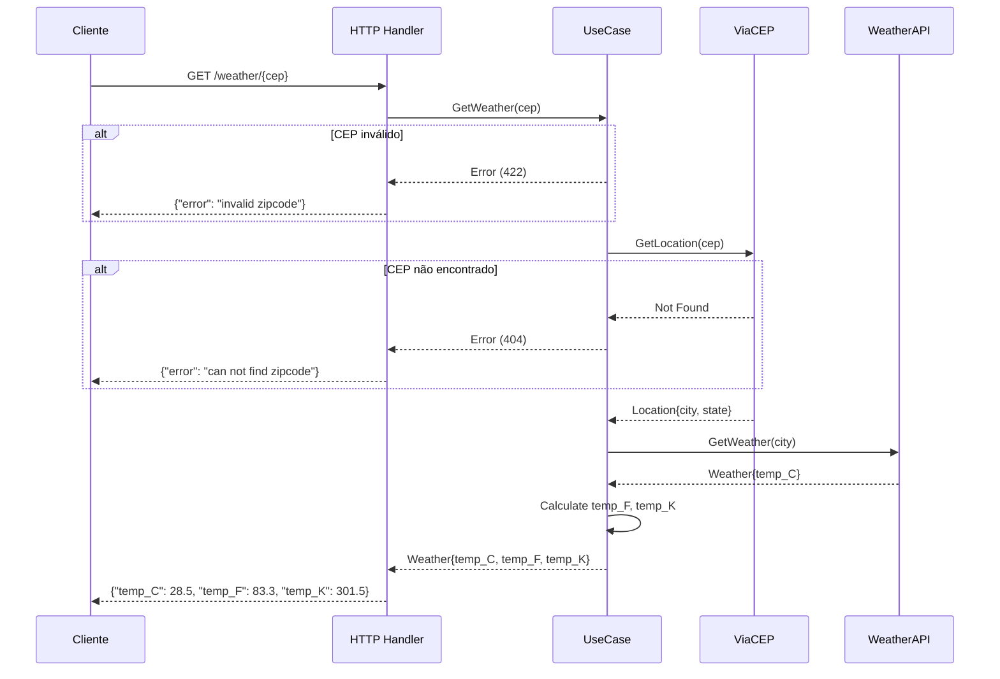

# Arquitetura do Sistema

Este documento descreve a arquitetura do sistema de consulta de clima por CEP.

## Visão Geral

O sistema é uma API RESTful desenvolvida em Go que recebe um CEP como entrada, identifica a cidade correspondente e retorna a temperatura atual em três unidades: Celsius, Fahrenheit e Kelvin.

## Padrões Arquiteturais

### Clean Architecture + Hexagonal Architecture

O projeto segue os princípios de **Clean Architecture** e **Arquitetura Hexagonal**, garantindo:

- **Separação de responsabilidades**: Cada camada tem uma responsabilidade bem definida
- **Independência de frameworks**: O core do negócio não depende de bibliotecas externas
- **Testabilidade**: Uso de interfaces permite fácil criação de mocks
- **Facilidade de manutenção**: Alterações em uma camada não afetam as outras

### Camadas do Sistema

## Estrutura de Camadas

### 1. Domain Layer (Core)

A camada mais interna, contém:

- **Entities**: Estruturas de dados do domínio (`Weather`, `Location`)
- **Ports/Interfaces**: Contratos que as camadas externas devem implementar
  - `LocationRepository`: Interface para busca de localização por CEP
  - `WeatherRepository`: Interface para busca de clima por cidade

### 2. Application Layer (Use Cases)

Contém a lógica de negócio:

- **GetWeatherByZipcodeUseCase**: Orquestra a busca de localização e clima
  1. Valida o CEP
  2. Busca a localização via `LocationRepository`
  3. Busca o clima via `WeatherRepository`
  4. Converte temperaturas para os três formatos
  5. Retorna o resultado

### 3. Infrastructure Layer (Adapters)

Implementações concretas:

- **HTTP Handler**: Recebe requisições HTTP e retorna respostas JSON
- **ViaCEP Client**: Implementação de `LocationRepository` usando a API ViaCEP
- **WeatherAPI Client**: Implementação de `WeatherRepository` usando a API WeatherAPI

## Fluxo de Dados

## Decisões Técnicas

| Aspecto | Decisão | Justificativa |
|---------|---------|---------------|
| Framework HTTP | `net/http` padrão | Simples, sem dependências extras |
| Injeção de Dependência | Manual via construtores | Clareza e simplicidade |
| Configuração | Variáveis de ambiente | Padrão Cloud Native |
| Logs | `slog` (Go 1.21+) | Structured logging nativo |
| Erros | Custom errors com tipos | Melhor tratamento de erros por camada |

## Requisitos Não Funcionais

- **Performance**: Resposta em menos de 2 segundos
- **Disponibilidade**: 99.9% (garantido pelo Cloud Run)
- **Escalabilidade**: Auto-scaling automático via Cloud Run
- **Observabilidade**: Logs estruturados para Cloud Logging
